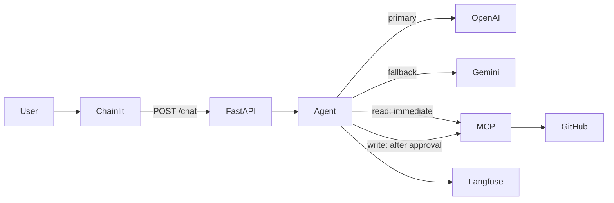

# GitHub MCP Production Chatbot

Production-oriented chatbot that lets users interact with GitHub through natural language. A Chainlit UI talks to a FastAPI backend, which runs an AI agent that calls GitHub tools through the official GitHub MCP server. OpenAI is the primary LLM; Gemini is used as a fallback. Write operations require explicit human approval before execution.

## Architecture and request flow



| Component | Role |
|-----------|------|
| **Chainlit** (`frontend/`) | Chat UI; streams assistant replies; shows Proceed/Reject for write tools |
| **FastAPI** (`backend/main.py`) | `GET /health`, `POST /chat`; session agents; pending approval state |
| **GitHubAgent** (`backend/agent/`) | Tool selection, streaming, MCP execution, approval gating |
| **OpenAI** (`backend/llm/openai_provider.py`) | Primary LLM with tool calling |
| **Gemini** (`backend/llm/gemini_provider.py`) | Fallback LLM with tool calling |
| **GitHub MCP** (`backend/mcp/github_client.py`) | MCP client to `ghcr.io/github/github-mcp-server` |
| **Langfuse** (`backend/observability/`) | Tracing for LLM, agent, retry, fallback, and MCP spans |
| **Reliability** (`backend/reliability/`) | Retry with exponential backoff; safe error normalization |

### Typical read request

1. User sends a message in Chainlit.
2. Chainlit `POST`s to `BACKEND_URL/chat` with `message` and `session_id`.
3. `GitHubAgent.stream_response()` calls OpenAI with MCP tool definitions.
4. For a read-only tool, the agent executes it via MCP immediately, then streams the final answer.
5. FastAPI returns a `text/plain` streaming response; Chainlit renders tokens as they arrive.

### Typical write request

1. Steps 1–3 above; the agent selects a write tool (e.g. `issue_write`).
2. The agent **does not** call MCP yet. FastAPI returns JSON: `{ "approval_required": true, "tool": { ... } }`.
3. Chainlit shows the tool name/arguments and **Proceed** / **Reject** buttons.
4. **Proceed** → `POST /chat` with `approval: "approve"` → `complete_decision(..., approved=True)` → MCP execution → streamed final response.
5. **Reject** → pending decision cleared → `"Operation cancelled."`

## Features

| Feature | Description |
|---------|-------------|
| Normal conversation | General chat without GitHub tools when the model answers directly |
| GitHub read operations | Supported read tools execute immediately via MCP (no approval) |
| GitHub write operations | Write tools require Proceed before MCP runs |
| Human-in-the-loop approval | Chainlit `AskActionMessage` with Proceed/Reject |
| Retry / backoff | Up to 3 attempts, delays 1s → 2s → 4s for transient LLM/network errors |
| OpenAI → Gemini fallback | After retries fail, or for missing/invalid OpenAI auth (non-retryable) |
| Error handling | Provider errors normalized to safe `LLMError` messages for users |
| Streaming responses | Token streaming for normal replies via `StreamingResponse` |
| Langfuse tracing | Optional; disabled when keys are not configured |
| Docker Compose | One-command stack: MCP server + backend + frontend |

## Project structure

```
.
├── frontend/
│   └── app.py              # Chainlit UI
├── backend/
│   ├── main.py             # FastAPI app
│   ├── env.py              # Loads .env from project root
│   ├── agent/
│   │   └── agent.py        # GitHubAgent, tool allowlists, approval logic
│   ├── llm/
│   │   ├── openai_provider.py
│   │   ├── gemini_provider.py
│   │   └── __init__.py     # generate_reply / stream_reply with fallback
│   ├── mcp/
│   │   └── github_client.py
│   ├── reliability/
│   │   ├── retry.py
│   │   └── errors.py
│   └── observability/
│       └── tracing.py
├── tests/
│   └── test_retry.py       # Unit and integration tests
├── docker-compose.yml
├── Dockerfile              # Backend image
├── Dockerfile.frontend     # Chainlit image
├── .env.example
├── chainlit.md
└── requirements.txt
```

## Supported GitHub / MCP operations

The agent exposes only tools whose names appear in `SUPPORTED_TOOL_NAMES` in `backend/agent/agent.py`. Tools advertised by the MCP server but not in this allowlist are ignored.

### Read-only tools (execute immediately)

| Tool | Purpose |
|------|---------|
| `get_commit` | Get a commit |
| `get_file_contents` | Read a file |
| `get_label` | Get a label |
| `get_latest_release` | Latest release |
| `get_me` | Authenticated GitHub user |
| `get_release_by_tag` | Release by tag |
| `get_tag` | Get a tag |
| `get_team_members` | Team members |
| `get_teams` | List teams |
| `issue_read` | Read an issue |
| `list_branches` | List branches |
| `list_commits` | List commits |
| `list_issue_fields` | Issue fields |
| `list_issue_types` | Issue types |
| `list_issues` | List issues |
| `list_pull_requests` | List pull requests |
| `list_releases` | List releases |
| `list_repository_collaborators` | List collaborators |
| `list_tags` | List tags |
| `pull_request_read` | Read a pull request |
| `search_code` | Search code |
| `search_commits` | Search commits |
| `search_issues` | Search issues |
| `search_pull_requests` | Search pull requests |
| `search_repositories` | Search repositories |
| `search_users` | Search users |

### Write tools (require Proceed)

| Tool | Purpose |
|------|---------|
| `add_comment_to_pending_review` | Comment on pending review |
| `add_issue_comment` | Add issue comment |
| `add_reply_to_pull_request_comment` | Reply to PR comment |
| `assign_copilot_to_issue` | Assign Copilot to issue |
| `create_branch` | Create branch |
| `create_or_update_file` | Create or update file |
| `create_pull_request` | Create pull request |
| `create_repository` | Create repository |
| `delete_file` | Delete file |
| `fork_repository` | Fork repository |
| `issue_write` | Create or update issues (`method: create` for new issues) |
| `merge_pull_request` | Merge pull request |
| `pull_request_review_write` | PR review write |
| `push_files` | Push files |
| `request_copilot_review` | Request Copilot review |
| `sub_issue_write` | Sub-issue write |
| `update_pull_request` | Update pull request |
| `update_pull_request_branch` | Update PR branch |

The alias `create_issue` from the LLM is normalized to `issue_write`. For create-issue requests, `issue_write` arguments are normalized before approval (including resolving `owner` via `get_me` when missing or incorrectly set to the repo name).

## Approval flow

```
User message
    → GitHubAgent.stream_response()
    → OpenAI (or Gemini fallback) selects tool
    → Write tool?
         Yes → normalize arguments → AgentStreamEvent(approval=decision)
              → FastAPI stores pending decision
              → JSON to Chainlit → Proceed / Reject UI
              → Proceed → complete_decision(approved=True)
              → execute_tool(approved=True) → MCP
              → final LLM response → stream to user
         No  → execute_tool() → MCP → final LLM response → stream to user
```

Write tools raise `PermissionError` if `execute_tool()` is called without `approved=True`.

## LLM reliability

### Retry

- **Max attempts:** 3 (`MAX_ATTEMPTS` in `backend/reliability/retry.py`)
- **Backoff:** 1s, 2s, 4s (`BASE_DELAY_SECONDS`, doubled each retry)
- **Retryable errors:** timeouts, connection errors, rate limits, HTTP 5xx (OpenAI and Gemini)
- **Non-retryable:** permanent configuration/auth errors (except fallback-eligible OpenAI auth cases below)
- Streaming retries only apply **before the first token** is yielded (avoids duplicate partial streams)

### Fallback (OpenAI → Gemini)

Triggered when `is_fallback_eligible()` is true:

- Retryable OpenAI failures after retries are exhausted
- OpenAI `AuthenticationError` (invalid key)
- Missing `OPENAI_API_KEY` (`ValueError`)

Authentication and missing-key errors are **not** retried; Gemini is attempted once. The agent streaming path and `backend/llm` both implement this pattern.

## Observability (Langfuse)

Tracing is **optional**. If `LANGFUSE_PUBLIC_KEY`, `LANGFUSE_SECRET_KEY`, and `LANGFUSE_BASE_URL` are set, the app records observations. Otherwise tracing is a no-op.

Langfuse is flushed after FastAPI responses via a `BackgroundTask`.

### Observation / span names

| Name | Type | When |
|------|------|------|
| `llm-request` | span | Generic LLM request wrapper |
| `openai-chat-completion` | generation | OpenAI non-streaming completion |
| `openai-chat-stream` | generation | OpenAI streaming completion |
| `gemini-content-generation` | generation | Gemini non-streaming |
| `gemini-content-stream` | generation | Gemini streaming |
| `llm-retry` | span | Retry on transient failure |
| `llm-stream-retry` | span | Stream retry before first token |
| `llm-fallback` | span | OpenAI → Gemini fallback |
| `agent-stream` | generation | Main agent streaming turn |
| `agent-tool-selection` | generation | Non-stream tool selection |
| `agent-final-response` | generation | Post-tool final OpenAI response |
| `github-agent-decision` | span | `decide()` path |
| `github-agent-completion` | span | `complete_decision()` after approval |
| `github-mcp-tool` | span | MCP `call_tool` execution |

## Environment variables

Copy `.env.example` to `.env` and fill in values. **Never commit `.env` or put secrets in Dockerfiles.**

| Variable | Required | Used by | Description |
|----------|----------|---------|-------------|
| `OPENAI_API_KEY` | Yes (primary LLM) | Backend | OpenAI API key |
| `OPENAI_MODEL` | No | Backend | Default: `gpt-4o-mini` |
| `GEMINI_API_KEY` | Yes (fallback) | Backend | Gemini API key |
| `GEMINI_MODEL` | No | Backend | Default: `gemini-2.0-flash` |
| `GITHUB_PERSONAL_ACCESS_TOKEN` | Yes | Backend, MCP | GitHub PAT for MCP server |
| `GITHUB_MCP_URL` | No | Backend | HTTP MCP URL; set by Docker Compose (`http://github-mcp:8082`). Omit for local stdio transport |
| `LANGFUSE_PUBLIC_KEY` | No | Backend | Langfuse public key |
| `LANGFUSE_SECRET_KEY` | No | Backend | Langfuse secret key |
| `LANGFUSE_BASE_URL` | No | Backend | Langfuse host (e.g. `https://cloud.langfuse.com`) |
| `BACKEND_URL` | No | Frontend | FastAPI URL. Default: `http://127.0.0.1:8000`. Compose sets `http://backend:8000` |
| `APP_ENV` | No | — | Present in `.env.example`; not read by application code |
| `LOG_LEVEL` | No | — | Present in `.env.example`; not read by application code |

Environment loading: `backend/env.py` loads `.env` from the project root (independent of working directory). Imported at backend startup and by `backend/observability/tracing.py`.

## Local development setup

**Prerequisites:** Python 3.12 or 3.13 (Chainlit 2.11.x is incompatible with Python 3.14), Docker (for local MCP stdio transport), API keys in `.env`.

```bash
python -m venv .venv
# Windows
.venv\Scripts\activate
# macOS/Linux
source .venv/bin/activate

pip install -r requirements.txt
cp .env.example .env
# Edit .env with your keys
```

Start the backend (terminal 1):

```bash
uvicorn backend.main:app --reload --port 8000
```

Start Chainlit (terminal 2):

```bash
chainlit run frontend/app.py --port 8001
```

Open **http://localhost:8001**.

### Local MCP transport

When `GITHUB_MCP_URL` is **not** set, `GitHubMCPClient` spawns the official image via:

```bash
docker run --rm -i -e GITHUB_PERSONAL_ACCESS_TOKEN ghcr.io/github/github-mcp-server stdio
```

Docker must be installed and running on the host.

## Docker Compose setup

Starts three services with one command:

```bash
docker compose up --build
```

| Service | Image / build | Host port | Internal role |
|---------|---------------|-----------|---------------|
| `github-mcp` | `ghcr.io/github/github-mcp-server` | — (internal `8082`) | GitHub MCP HTTP server |
| `backend` | `Dockerfile` | `8000` | FastAPI + agent |
| `frontend` | `Dockerfile.frontend` | `8001` | Chainlit UI |

### How services communicate

```
Browser → frontend:8001 (Chainlit)
frontend → backend:8000 (BACKEND_URL=http://backend:8000)
backend → github-mcp:8082 (GITHUB_MCP_URL, Bearer token)
github-mcp → GitHub API
```

- Secrets come from `.env` via `env_file` (not baked into images).
- Compose overrides `GITHUB_MCP_URL` and `BACKEND_URL` for container networking.
- Local stdio/Docker-run MCP is **not** used inside Compose.

**URLs after startup:**

- Chainlit UI: http://localhost:8001
- FastAPI: http://localhost:8000
- Health check: http://localhost:8000/health

Stop the stack:

```bash
docker compose down
```

## Testing

Run the full suite:

```bash
pytest tests/test_retry.py -v
```

Run a subset:

```bash
pytest tests/test_retry.py -k "approval" -v
```

Optional integration test (requires Docker + `GITHUB_PERSONAL_ACCESS_TOKEN`, stdio transport only):

```bash
pytest tests/test_retry.py -k "github_mcp_client_lists_tools" -v
```

List MCP tools manually:

```bash
python tests/debug_github_tools.py
```

## Example prompts

### Normal conversation

```
Hello! What can you help me with?
```

### GitHub read operation

```
Who am I on GitHub?
```

```
Search for open issues related to authentication in my repository github-mcp-chatbot.
```

### GitHub write operation (approval)

```
Create an issue in my repository github-mcp-chatbot titled "Test issue"
```

Expected: Chainlit shows **Proceed** / **Reject** with `issue_write` arguments (`owner` resolved to your GitHub username). The issue is **not** created until you click **Proceed**.

### Failure / retry / fallback testing

| Goal | How |
|------|-----|
| Retry | Temporarily disrupt network or trigger rate limits on OpenAI; check Langfuse for `llm-retry` / `llm-stream-retry` |
| Fallback | Unset or invalidate `OPENAI_API_KEY` in `.env` and restart backend; request should route to Gemini (`llm-fallback` in Langfuse) |
| Missing MCP token | Unset `GITHUB_PERSONAL_ACCESS_TOKEN`; agent fails to connect to MCP |

## Troubleshooting and known limitations

| Issue | Cause / mitigation |
|-------|-------------------|
| OpenAI falls back to Gemini unexpectedly | Ensure `.env` is loaded (`backend/env.py`); restart backend after editing `.env` |
| `GITHUB_PERSONAL_ACCESS_TOKEN is not set` | Add PAT to `.env` |
| Local MCP fails | Docker must be running; `GITHUB_MCP_URL` must be unset for stdio mode |
| Compose MCP fails | Ensure `github-mcp` service is up; backend uses `http://github-mcp:8082` |
| Port already in use | Stop other processes on `8000`/`8001` before `docker compose up` or local uvicorn/chainlit |
| Wrong `owner` on create issue | Agent resolves owner via `get_me` when missing or equal to repo name; verify approval payload before Proceed |
| No Langfuse traces | Set all three Langfuse variables; tracing is disabled if any is missing |
| No end-user authentication | Application has no login; suitable for local/demo use only |
| Session state in memory | Agents and pending approvals live in process memory (`backend/main.py`); not persisted across restarts |
| Backend image includes Chainlit | Both Docker images install full `requirements.txt` for simplicity (larger backend image) |
| `APP_ENV` / `LOG_LEVEL` | Defined in `.env.example` but not consumed by code yet |

## API reference

### `GET /health`

Returns `{"status": "ok"}`.

### `POST /chat`

**Body:**

```json
{
  "message": "string",
  "session_id": "string",
  "approval": "approve | reject | null"
}
```

**Responses:**

- `text/plain` stream — normal or post-approval reply
- `application/json` — `{ "approval_required": true, "tool": { "name", "arguments" } }` when a write tool needs approval
- `4xx/5xx` — normalized `LLMError` or generic 502 for unexpected failures
